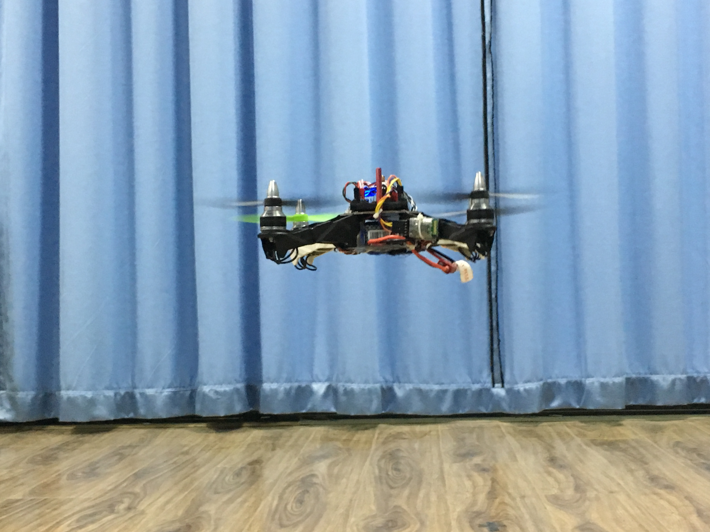
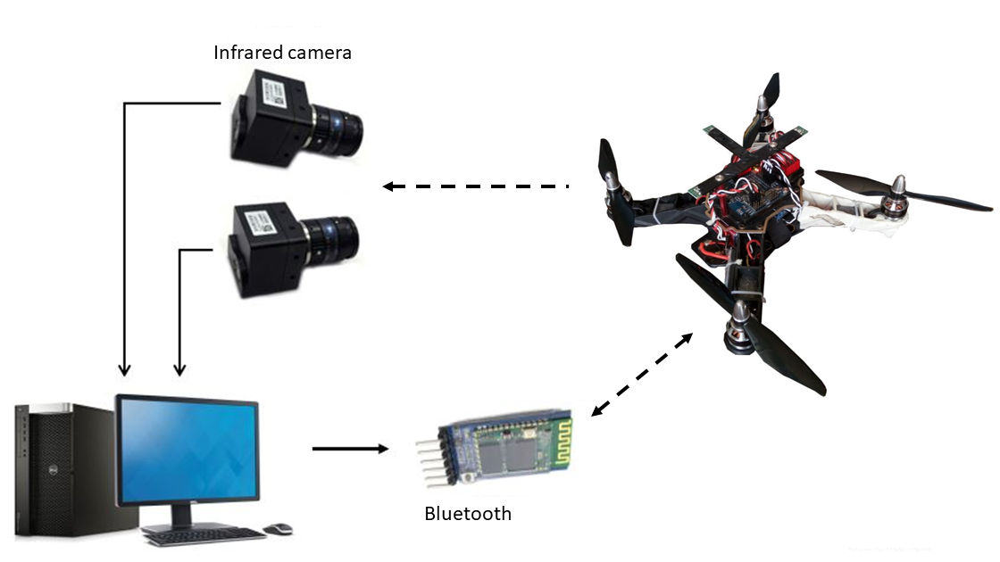

# STM32F4-Quad
[STM32F4](https://www.st.com/en/microcontrollers-microprocessors/stm32f405rg.html) based Quadrotor Flight Controller running on the RTOS uC/OS-III, mainly tested in indoor environment. 

Function: Attitude/Position Control and Trajectory Tracking.

A vision-based (infrared cameras) indoor navigation system (mocap like) is included, which using active infrared makers as locators.

The Flight Controller is developed with uVison Keil4 using C, the positioning system is based on OpenCV library.  

<!--  -->

## Folder  
STM32F4-Quad\
  | -- **Indoor_Positionning_System** (source code for indoor positioning system in PC)\
  | -- **Matlab** (Matlab simulation of the quadrotor)\
  | -- **Quad_indoor_cam**(vision) (source code of the flight controller)\
  | -- **Quad_3D_display** (position and attitude visualization)\
  | -- **Stereo_Camera_Calibration** (code for camera calibration)\
  \\ -- **tex** (source code for the dissertation)

## Test Videos
**Playing music:**  
["Little Star"](https://youtu.be/FTTgFP2V9RU).

**Gesture control:**  
[Kinect](https://youtu.be/_VyHRGHKnpY).

**Trajectory tracking:**
- [curve1](https://youtu.be/Airv29XN67Q)
- [1D sine](https://youtu.be/eWLOpIESicU)
- [3D path](https://youtu.be/p_XNRUGR_co) 
- [straight line](https://youtu.be/EVki9DBirWQ)
- [planar rotating](https://youtu.be/JW-OWvRWwpA)
